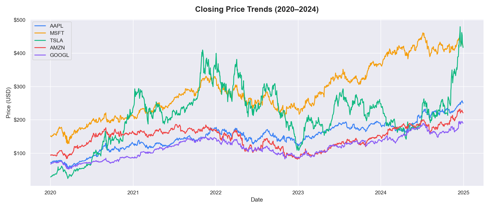
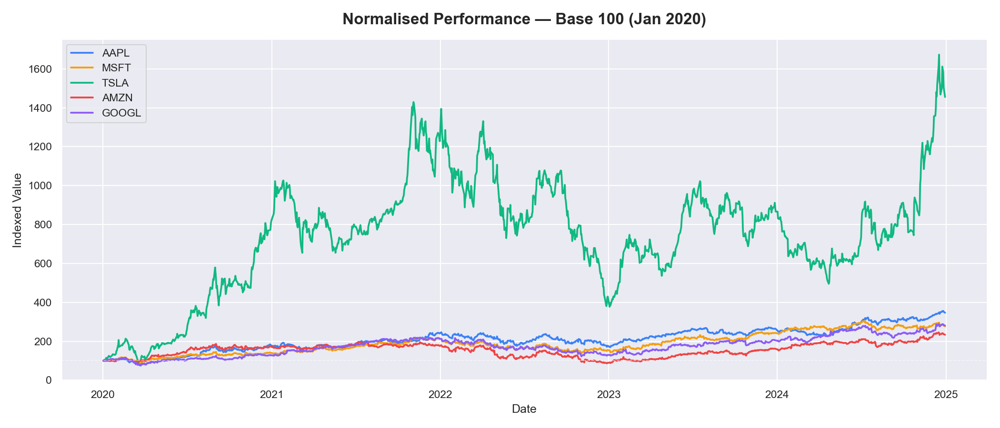
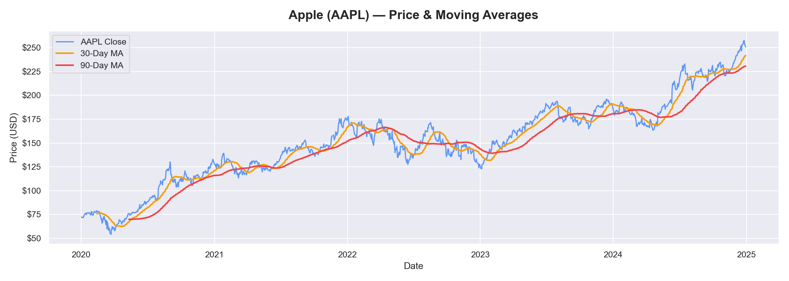
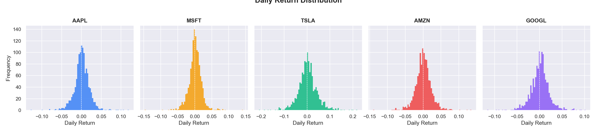
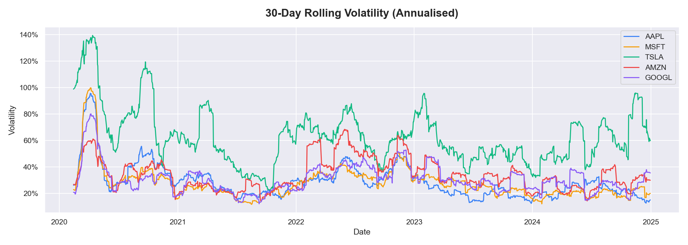
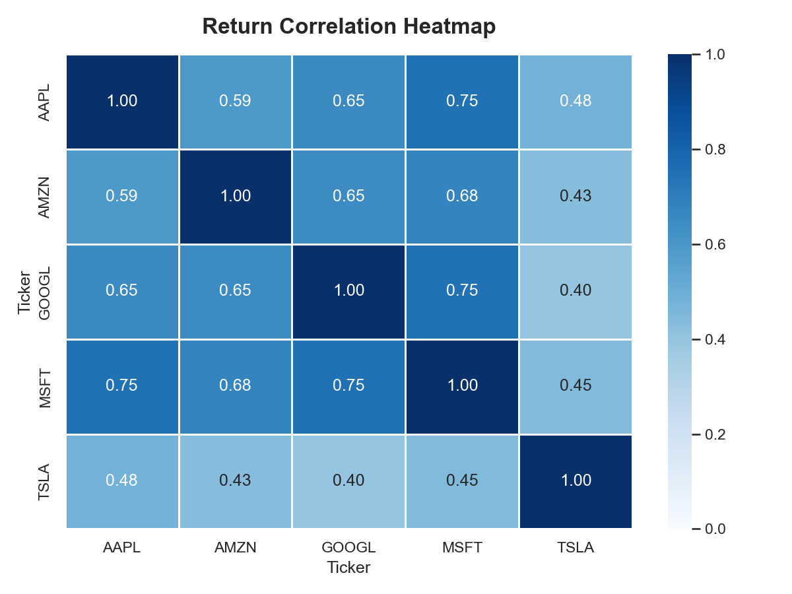

# 📈 StockLens — Stock Price Analysis

An exploratory data analysis of five major tech stocks (AAPL, MSFT, TSLA, AMZN, GOOGL) using live market data pulled directly from Yahoo Finance. No dataset download needed — data is fetched automatically.

---

## 📋 Table of Contents

- 🎯 Project Overview
- 📊 Key Questions Answered
- 📈 Visualizations
- 🛠️ Technologies Used
- 📁 Project Structure
- 🚀 How to Run
- 💡 Key Findings
- 👨‍💻 Author

---

## 🎯 Project Overview

This project analyses the stock price behaviour of five major tech companies between **2020 and 2024**. The analysis covers price trends, moving averages, daily return distributions, annualised volatility and cross-stock correlations.

Data is fetched live via `yfinance` — no manual download required.

---

## 📊 Key Questions Answered

- How did each stock perform from 2020 to 2024?
- Which stock delivered the highest total return?
- Where are the 30-day and 90-day moving averages relative to price?
- How are daily returns distributed — how risky is each stock?
- How volatile is each stock on a rolling basis?
- How correlated are these stocks with each other?

---

## 📈 Visualizations

### Closing Price Trends


### Normalised Performance (Base = 100)


### Moving Averages — Apple (AAPL)


### Daily Return Distribution


### 30-Day Rolling Volatility


### Return Correlation Heatmap


---

## 🛠️ Technologies Used

- **Language:** Python 3.12
- **Data Source:** Yahoo Finance via `yfinance`
- **Data Manipulation:** Pandas, NumPy
- **Visualization:** Matplotlib, Seaborn
- **Environment:** Jupyter Notebook

---

## 📁 Project Structure

```
StockLens/
├── analysis.ipynb       ← Main analysis notebook
├── requirements.txt
├── README.md
└── outputs/
    ├── closing_prices.png
    ├── normalised_performance.png
    ├── aapl_moving_averages.png
    ├── daily_returns.png
    ├── volatility.png
    └── correlation_heatmap.png
```

---

## 🚀 How to Run

**1. Install dependencies:**
```bash
pip install -r requirements.txt
```

**2. Run the notebook:**
```bash
jupyter notebook analysis.ipynb
```

Data is fetched automatically from Yahoo Finance — no CSV needed.

---

## 💡 Key Findings

- **Tesla (TSLA)** had the highest peak return but also the highest volatility
- **Microsoft (MSFT)** showed the most consistent upward trend across the period
- All five stocks are positively correlated — when the market drops, they tend to drop together
- Volatility spiked significantly in **early 2020** (COVID-19) and **late 2022** (rate hikes)
- Apple's **30-day MA crossing the 90-day MA** signals short-term momentum shifts

---

## 👨‍💻 Author

**Berke Arda Turk**  
Data Science & AI Enthusiast | Computer Science (B.ASc)  
[🌐 Portfolio](https://berkeardaturk.com) · [💼 LinkedIn](https://www.linkedin.com/in/berke-arda-turk/) · [🐙 GitHub](https://github.com/Mood07)
